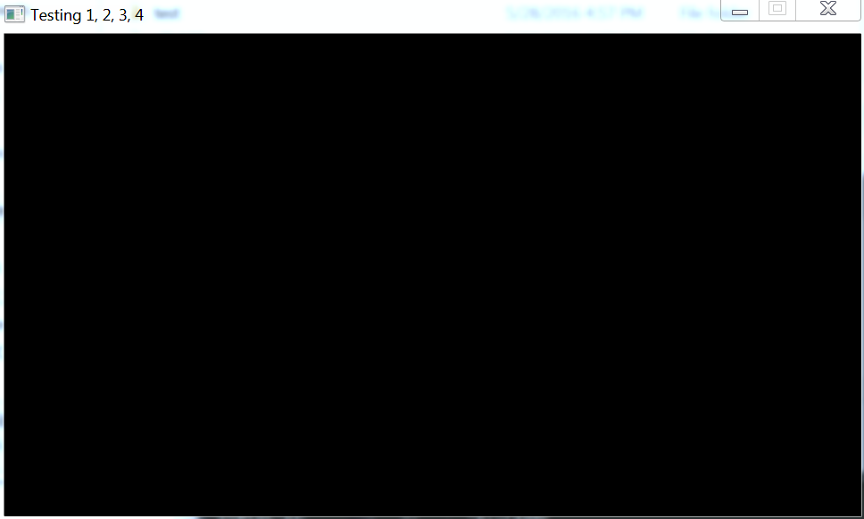
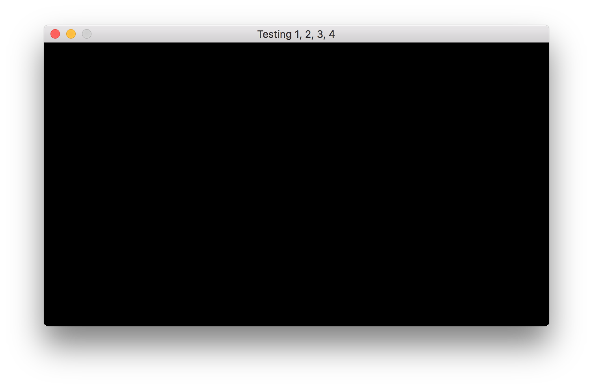

# Step 02

Second step on creating the Dinodeck engine. This adds the PhysFS for package management and LuaJIT. There's now a settings file to control how to launch the engine and it can be dynamically reloaded.

## Building on Windows

For reference I've just built with

PhysFS 2.03
LuaJIT 2.03

Yeh the same version :o

###PhysFS

It needs CMake. Download and install it. You may need log in and out to get the env variables registered. In msys you should be able to type

	cmake

And get a help print out. If that's working, go the PhysFS dir and run

cmake -G "MSYS Makefiles" . -DCMAKE_CXX_COMPILER=g++ -DCMAKE_CC_COMPILER=gcc

Then

	make && make install

###LuaJIT

Go to the src directory. Open the makefile and change

	# Mixed mode creates a static + dynamic library and a statically linked luajit.
	#BUILDMODE= mixed
	#
	# Static mode creates a static library and a statically linked luajit.
	BUILDMODE= static

I find if you do mixed mode, it doesn't generate the .a.

## Building on Mac

